# Firefly-SRC使用手册
## 简介
> Firefly是一个集资产管理、信息收集和漏洞扫描的综合平台。

> Firefly-SRC依托于Firefly平台中的信息收集功能，不断收集和整理各大src相关资产数据。希望能为各位白帽子师傅们提供更稳定可靠的src资产数据，减少师傅挖洞前期的信息收集时间，将精力更多的投入在挖漏洞上面。

* 收录国内SRC厂商200+，收录国外SRC厂商400+。
* 主要是各自建src，hackone，补天等漏洞平台中有赏金的公司。
* 共收集域名资产500多万条，网站资产160多万条。
* 7\*24小时不间断更新所收录的资产数据。


**声明:**

* 平台的信息收集相关功能不存在任何攻击行为，也不存在对目标的大量探测请求，不会对目标业务造成任何影响;
* Firefly-SRC收集范围仅包括各大src资产，不收集和提供任何非src资产
* 如收集到非src和赏金范围的资产可联系我，收到后会取消对这些资产的关注。


**访问地址**

http://firefly.geekyoung.com

**账号获取**

关注公众号`安全小工坊`回复 `我的信息` 或者 `token` 可以得到公众号生成的用户token，使用这个**token**即可登录平台


## 界面及功能使用
### 首页
可以在首页**修改昵称**、**切换关注SRC**、**兑换平台权限**等。

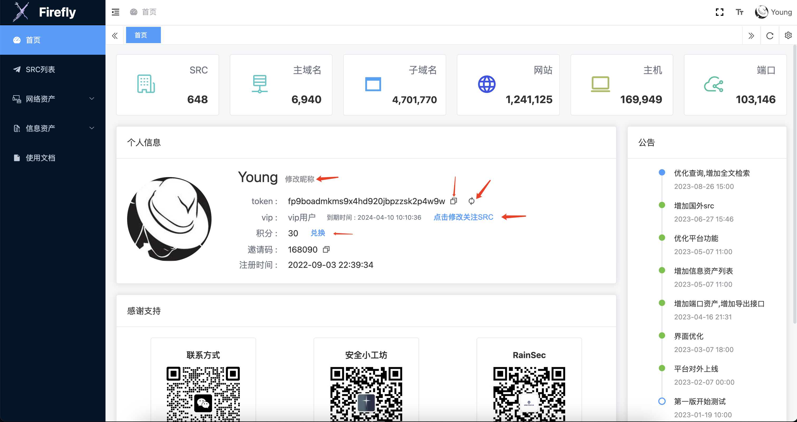


首次使用资产列表都是空的 使用需要点击修改关注SRC按钮设置关注src

* 关注src有最大上限，可通过 `资产列表-SRC列表` 查看所有的src及其对应的资产数量，根据结果选择自己想要关注的src。
* 可通过积分增加关注的最大上限
* 更新时间间隔为30天

目前收录的src主要为国内的企业自建src、专属src。即只收录给赏金的src。如果有未收录的欢迎各位师傅联系我哦。

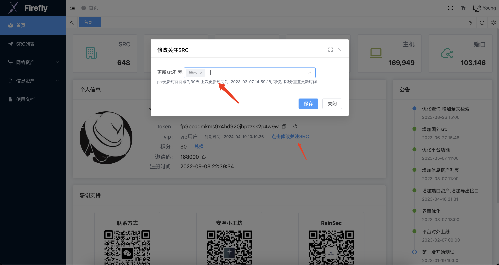


点击`兑换`按钮可以用积分兑换各类权限

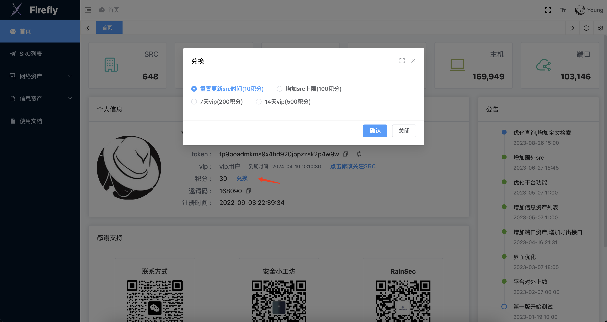


### SRC列表
展示平台各SRC资产统计信息。

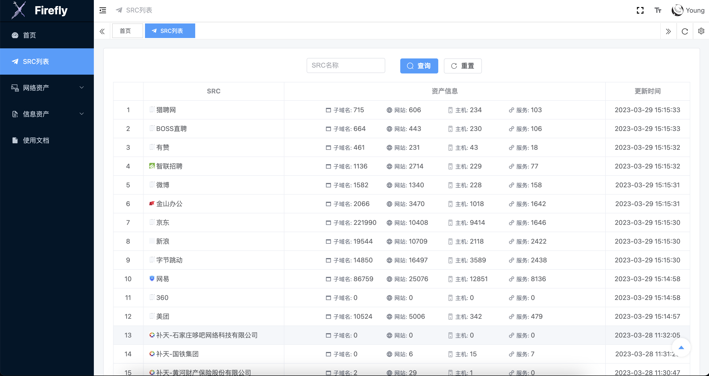


### 网络资产
#### 主域名列表
* **可点击添加按钮来增加平台未收录的域名**

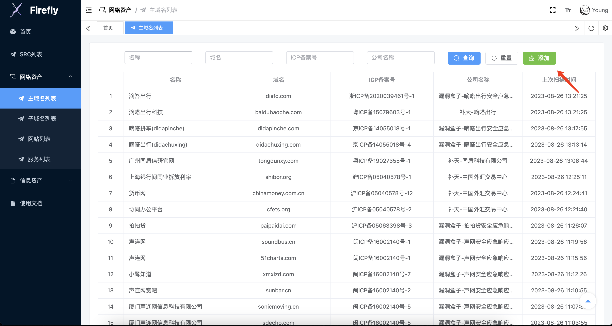


#### 子域名列表


#### 网站资产
* 可点击url右侧的图标获取更多网站相关信息。
* 所有的指纹名称见:

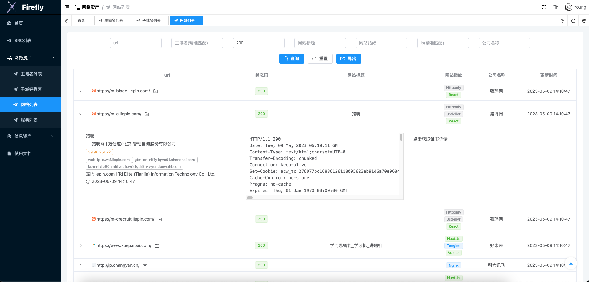

#### 服务资产
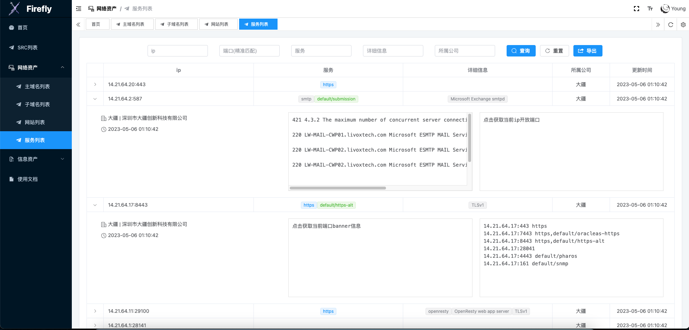


### 信息资产
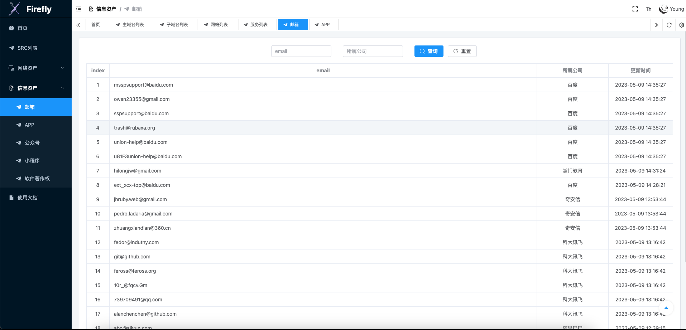


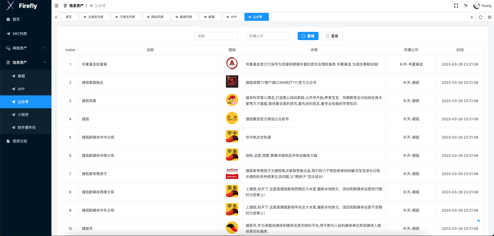

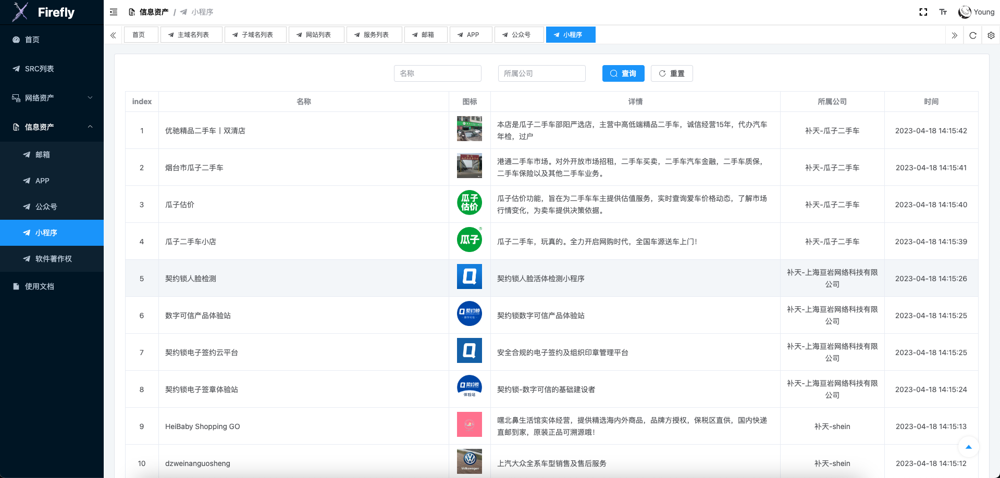


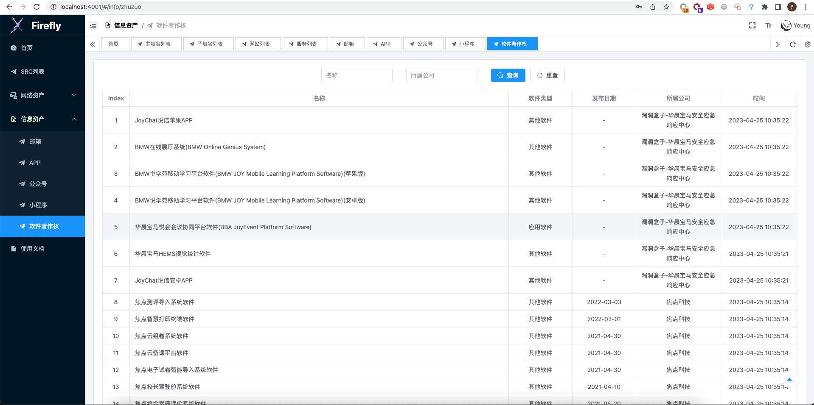


## 接口文档
请求方式: POST

请求头:

```bash
Authorization: Bearer xxxxxx
Content-Type: application/json
```


### 子域名查询
接口地址

```bash
http://firefly.geekyoung.com/api/subdomain/list
```
参数


|参数名称|类型|示例|备注|
| ----- | ----- | ----- | ----- |
|subdomain|string|\-| |
|main|string|qq.com|精准匹配|
|ips|string|127.0.0.1|精准匹配|
|cnames|string|\-|精准匹配|
|enterprise|string|\-| |
|update\_time|int|1678289313|大于update\_time的资产，单位:秒|
|page|int|1|默认为1|
|per\_page|int|20|可不填，只允许20|
|q|string| |高级查询|


响应示例

```bash
{
     "code": 200,
     "data": [
          {
               "business": "上海携程商务有限公司",
               "cnames": [],
               "enterprise": "携程旅游",
               "id": "622821ca58abfe145bce8fa4",
               "ips": [
                    "47.101.135.192"
               ],
               "subdomain": "guoneizuche.com",
               "update_time": 1683616099
          },
          ...
     ],
     "message": "success",
     "total": 1520920
}
```
### 网站查询
接口地址

```bash
http://firefly.geekyoung.com/api/web/list
```
参数


|参数名称|类型|示例|备注|
| ----- | ----- | ----- | ----- |
|url|string|\-| |
|status\_code|int|200| |
|title|string| | |
|fingers|string| | |
|server|string| | |
|icon\_hash|string| | |
|cert\_cn|string| | |
|cert\_hash|string| | |
|cert\_org|string| | |
|domain|string| |精准匹配|
|ips|string|127.0.0.1|精准匹配|
|cnames|string|\-|精准匹配|
|enterprise|string|\-| |
|header|string| | |
|html|string| | |
|cert|string| | |
|update\_time|int|1678289313|大于update\_time的资产，单位:秒|
|page|int|1|默认为1|
|per\_page|int|20|可不填，只允许20|
|q|string| |高级查询|


响应示例

```bash
{
     "code": 200,
     "data": [
          {
               "api_list": false,
               "business": "深圳市腾讯计算机系统有限公司",
               "cert_cn": "",
               "cert_hash": "",
               "cert_org": "",
               "cnames": [
                    "zzq.qq.com.sched.p2.tdnsv6.com"
               ],
               "create_time": 1676078781,
               "enterprise": "腾讯",
               "finger_category": [
                    [
                         "腾讯云Cdn",
                         9
                    ]
               ],
               "ico_hash": "",
               "ico_url": "",
               "id": "63e6eebdfd136d8a5927deb9",
               "ips": [
                    "220.194.122.42",
                    "220.194.122.48"
               ],
               "server": "CDN_NWS_4.6.2",
               "status_code": 404,
               "title": "",
               "update_time": 1683612647,
               "url": "http://zzq.qq.com.cloud.tc.qq.com/"
          },
          ...
     ],
     "message": "success",
     "total": 23255
}
```
### 服务查询
接口地址

```bash
http://firefly.geekyoung.com/api/service/list
```
参数

|参数名称|类型|示例|备注|
| ----- | ----- | ----- | ----- |
|ip|string|127.0.0.1| |
|port|int|3389|精准匹配|
|service|string|\-| |
|version|string|\-| |
|enterprise|string|\-| |
|banner|string| | |
|update\_time|int|1678289313|大于update\_time的资产，单位:秒|
|page|int|1|默认为1|
|per\_page|int|20|可不填，只允许20|
|q|string| |高级查询|

响应示例

```bash
{
     "code": 200,
     "data": [
          {
               "business": "深圳市大疆创新科技有限公司",
               "enterprise": "大疆",
               "id": "62d0e25db861af00d21ee2f4",
               "ip": "14.21.64.20",
               "port": 443,
               "service": [
                    "https"
               ],
               "update_time": 1683306642,
               "version": []
          },
          ......
     ],
     "message": "success",
     "total": 106059
}
```


### python示例
```bash
import json

import requests

url = 'http://firefly.geekyoung.com/api/web/list'
token = '' #这里填写token
headers = {
    'Authorization': 'Bearer ' + token,
    'Content-Type': 'application/json'
}

// 设置查询参数
data = {
    'domain':'qq.com',
    'status_code': 200,#参数
    'page':1,
}

response=requests.post(url,headers=headers,data=json.dumps(data))
print(response.text)
```


## 高级查询
参数q可利用AND OR NOT 完成更复杂的查询。

简单示例：`status_code:200 AND enterprise:"腾讯" AND NOT domain:".qq.com"`

* 支持对应接口的所有字段
* 支持使用`()`设置优先级,括号内容优先级最高
* 其他查询参数也存在时返回同时满足普通查询和高级查询的资产


## vip功能
**获取方式**

1. 通过积分在首页进行兑换
2. 通过添加微信打赏200r可获取一年vip

**权限对比**

|功能|普通|vip|
| ----- | ----- | ----- |
|主域名|仅关注SRC|所有SRC|
|子域名|仅关注SRC|所有SRC|
|网站|仅关注SRC|所有SRC|
|服务|仅关注SRC|所有SRC|
|邮箱|\-|所有|
|APP|\-|所有|
|公众号|\-|所有|
|小程序|\-|所有|
|软件著作权|\-|所有|
|资产导出|300条|10000条|


## 常见问题
### 登录和账号问题
* 平台没有使用传统的账号密码注册，**唯一的认证凭证是token**；
* 为了方便各位师傅直接调用api接口，**token永不过期**，除非手动刷新。
* 为方便各位师傅在浏览器上的使用，平台只要登录一次，就会在浏览器保存认证信息，**不需要再次登录**，除非刷新浏览器缓存或者手动退出。

公众号回复 `我的信息` 或者 `token` 可以得到公众号生成的用户token，使用这个**token**即可登录平台


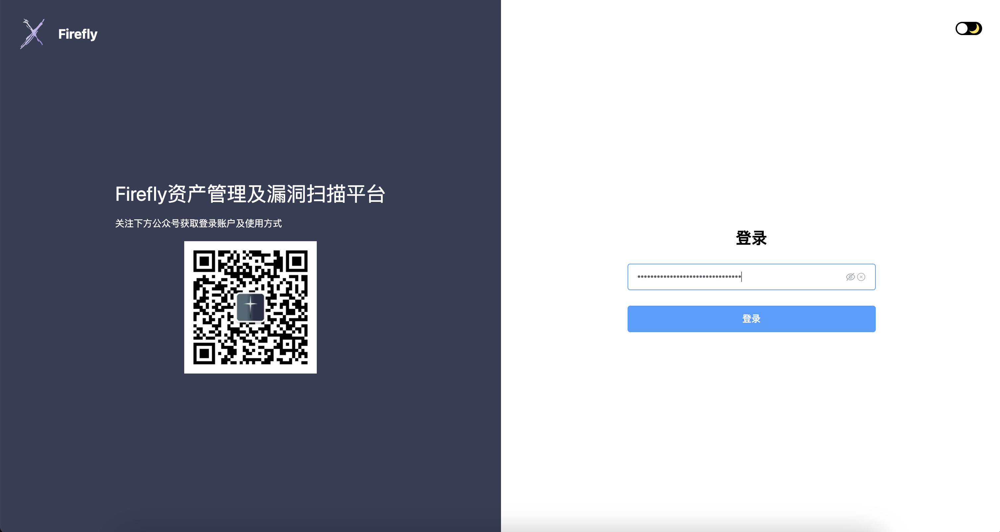

### 积分获取
* 关注公众号即可获得30积分;
* 绑定邀请码可获得20积分
* 邀请新用户可获得10积分(绑定自己的邀请码),前10次被绑定可双倍积分
* 加入微信群可获取100积分
* 平台通过一些其他方式发放积分，比如平台会不定期发放一些兑换码


### 积分使用
点击首页的`兑换`按钮即可使用

* 10积分：重置src切换时间 
* 100积分：永久增加关注src上限1个，最大可关注5个 
* 200积分：7天vip权限 
* 500积分：30天vip权限 

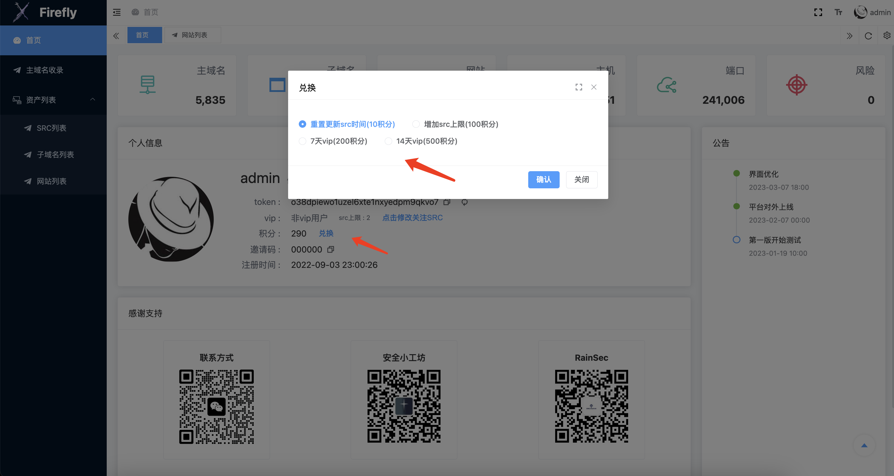


### 邀请码
邀请码是一个常驻的获取积分的途径；

绑定邀请码是发送**邀请码+6个数字**。

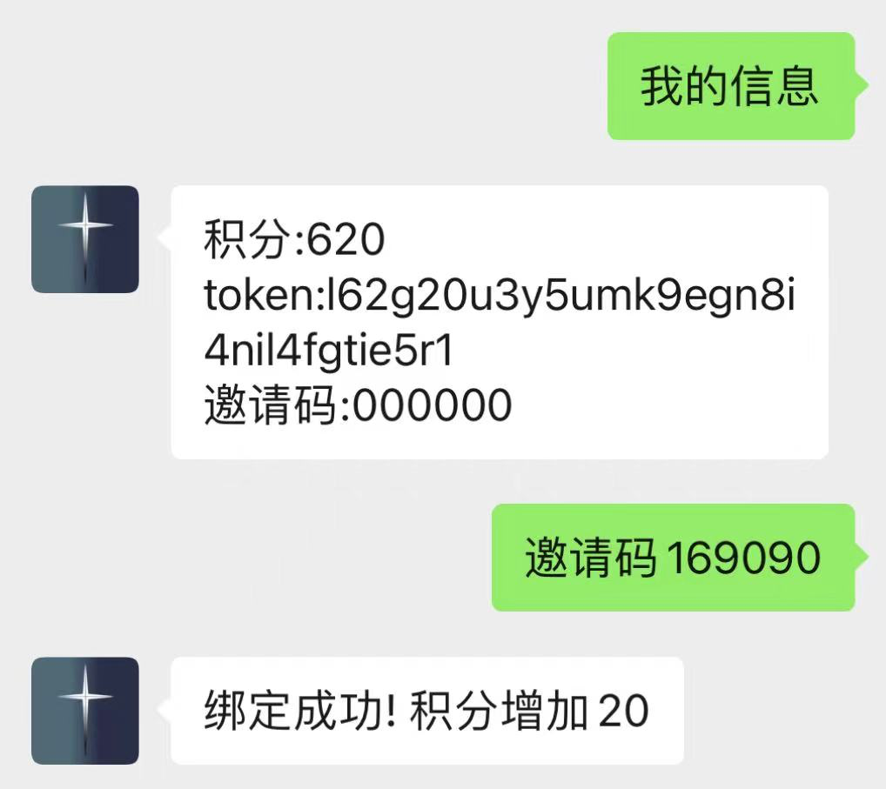


### 交流群


