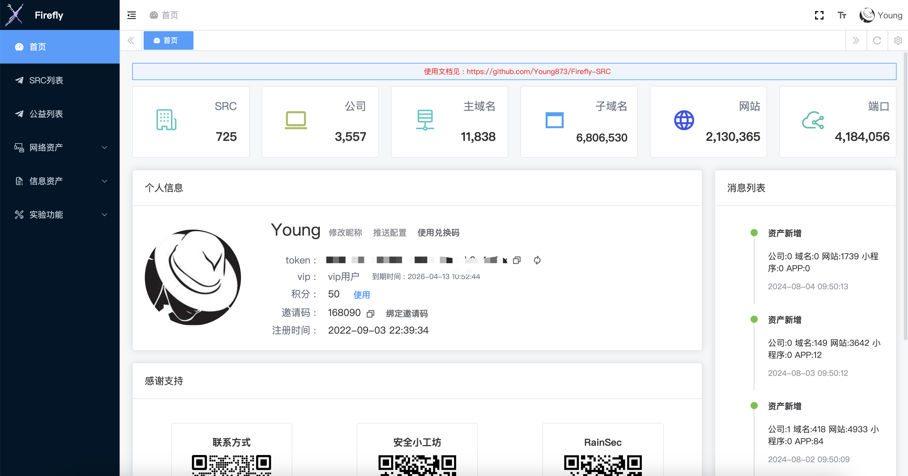

# Firefly-SRC资产探测平台使用手册

> Firefly是一个集资产管理、信息收集和漏洞扫描的综合平台。

> Firefly-SRC依托于Firefly平台中的信息收集功能，不断收集和整理各SRC相关资产数据。希望能为各位白帽子师傅们提供更稳定可靠的SRC资产数据，减少师傅挖洞前期的信息收集时间，将精力更多的投入在挖漏洞上面。



**平台特点**

* 以国内外所有的SRC资产为目标做精准收集，绝大多次资产皆为赏金目标，发现漏洞即可提交SRC获取赏金。
* 7\*24小时不间断收集，持续监控及更新数百家SRC，累计数百万资产数据。
* 节点皆为全自研或二次优化过的数据采集工具，拥有更高的测绘维度及效率。
* 提供小程序、APP等信息资产探测能力，扩大挖洞维度。
* 高效的整合及清洗能力，保证数量及质量都在较高水平。


**平台作用**

* 随时随刻直接挖洞，免去资产收集或者资产长时间未更新的烦恼。
* 通用型思路或者漏洞快速横向其他SRC资产，扩大挖洞战果。
* 使用API接口配合漏洞插件等实现自动化挖洞。
* 提高资产收集结果的下限，小白也能拥有较高SRC信息收集成果。


**声明**

* Firefly-SRC平台使用的节点功能皆以信息收集为目的，只有少量正常访问请求，无任何攻击特征，不会对目标业务造成任何影响。


## 平台使用

**平台地址**

```bash
https://firefly-src.geekyoung.com/
```


**登录方式**

* 平台目前没有使用传统的账号密码注册，**唯一的认证凭证是token**；
* 为了方便各位师傅直接调用api接口，**token永不过期**，除非手动刷新。
* 为方便各位师傅在浏览器上的使用，平台只要登录一次，就会在浏览器保存认证信息，**不需要再次登录**，除非刷新浏览器缓存或者手动退出。

**token获取**

公众号回复 `我的信息` 或者 `token` 可以得到公众号生成的用户token，使用**token（32位的字符串）**即可登录平台


## 常见问题

### 为什么没有资产

首次登录平台，关注的src列表是空的，配置之后才会有对应的资产。


### 积分获取

* 绑定他人邀请码获20积分
* 每邀请用户绑定自己的邀请码可获取20积分

### 积分使用

点击首页的**使用**按钮，选择对应的内容进行兑换。


### 邀请码使用

1. 登录平台首页，点击 **绑定邀请码**
2. 公众号回复邀请码绑定


### 兑换码使用

1. 登录平台首页，点击使用兑换码
2. 公众号直接回复兑换码

### 如何加群

添加微信后**主动回复加群**会拉师傅进群，没有要求加群的不会主动拉群\~

### 如何添加公司

点击 **实验功能-公司查询** ，输入公司关键字搜索，点击添加，选择正确的SRC即可。添加后会进入审核状态，通过后可在页面查询相关其资产，SRC资产会进行周期的信息收集，非SRC资产会在节点空闲时进行收集。

### 如何添加域名

点击 **网络资产-主域名列表**，点击添加按钮进行添加，必须输入正确的SRC及域名。添加后会进入审核状态，通过后SRC资产会进行周期的信息收集，非SRC资产会在节点空闲时进行收集。

### 如何添加新SRC

添加微信私聊SRC名称及SRC地址。

### 超出1w条的如何导出

平台暂不提供大于一万条的导出接口

如果查询结果超出一万条，可以调整查询条件，分开导出，比如一次导出一个域名的资产，或者第一次导出状态码200的资产第二次导出非200的资产等


## VIP相关

### VIP获取

1. 积分兑换，首页兑换功能处兑换。
2. 付费获取，公众号获取微信二维码添加微信，200一年。

ps: 关于VIP试用，50积分兑换一天的vip。（新用户关注公众号赠送10积分，绑定邀请码获得20积分，邀请一位用户绑定自己可获得20积分）

### VIP和非VIP区别

|功能|普通|VIP|
| ----- | ----- | ----- |
|主域名|仅关注SRC|所有SRC|
|子域名|仅关注SRC|所有SRC|
|网站|仅关注SRC|所有SRC|
|服务|仅关注SRC|所有SRC|
|邮箱|仅关注SRC|所有SRC|
|APP|仅关注SRC|所有SRC|
|公众号|仅关注SRC|所有SRC|
|小程序|仅关注SRC|所有SRC|
|公益资产|\-|✅|
|消息推送|\-|✅|
|保存查询语法|\-|✅|
|Web详情|\-|✅|
|资产导出|10000条|10000条|


## 高级查询使用

在高级查询搜索框可利用`AND`、`OR`、`NOT`等实现更灵活的查询。

简单示例：`status_code:200 AND enterprise:"腾讯" AND NOT domain:".qq.com"`

* 支持对应接口的所有字段，具体字段可见API文档
* 支持使用`()`设置优先级,括号内容优先级最高
* 其他查询参数也存在时返回同时满足普通查询和高级查询的资产


利用语法查询过滤不关注的资产，比如泛解析，404，cdn域名等。

```bash
(enterprise:"百度" OR enterprise:"腾讯" OR enterprise:"阿里巴巴" ) 
AND status_code:200 
AND is_ip:false 
AND NOT title: "阿里云 Web应用防火墙"
AND NOT title: "Welcome to OpenResty!"
AND NOT title: "hao123导航-上网从这里开始"
AND NOT url: ".hichina.com"
AND NOT url: ".tdum.alibaba.com"
AND NOT domain: "tencentapigw.com"
AND NOT body: "Please report this message and include the following information to us."
AND NOT body: "The Requested URL could not be retrieved"
AND NOT (body: "<!-- web cache -->" AND status_code:403)
```


点击 **更多操作-收藏查询条件** 可保存当前条件，方便后续调用


## 推送配置

支持推送特定内容到钉钉、飞书、企业微信。

推送内容包括

* 新增SRC: 实时推送，发现新的SRC立即推送
* 新增资产: 定时推送，查询并推送前24小时新增的资产数量，需要在收藏查询中标记为推送。

### 钉钉

推送的Key的格式: {access\_token}#{加签字符串}


access\_token在webhook的地址中获取，安全设置选择加签，复制的字符串为加签字符串


例如:

webhook:https://oapi.dingtalk.com/robot/send?access\_token=xxxxxxxxxx

加签:537ad74adxxxxxxxx6b9b4282b4dc73ffe9

那么钉钉的推送Key为:

xxxxxxxxxx#537ad74adxxxxxxxx6b9b4282b4dc73ffe9

### 飞书

飞书的推送Key为webhook后面的字符串，不使用安全配置，例如

https://open.feishu.cn/open-apis/bot/v2/hook/xxxxxxx-xxxx-xxxx-xxx-xxxxxxxx

那么飞书的推送key为xxxxxxx-xxxx-xxxx-xxx-xxxxxxxx


### 企业微信

企业微信的推送key为参数key的值，例如

https://qyapi.weixin.qq.com/cgi-bin/webhook/send?key=xxxxx-xxxxx-xxxx-xxxx-xxxxxx

那么企业微信的推送key为xxxxx-xxxxx-xxxx-xxxx-xxxxxx


## API文档

请求方式: POST

请求头:

```bash
Authorization: Bearer xxxx[替换成自己的token]
Content-Type: application/json
```
### 子域名查询

**接口地址**

```bash
https://firefly-src.geekyoung.com/api/subdomain/list
```
**接口参数**

|参数名称|类型|示例|备注|
| ----- | ----- | ----- | ----- |
|subdomain|string|\-| |
|main|string|qq.com|精准匹配|
|ip|string|127.0.0.1|精准匹配|
|cname|string|\-|精准匹配|
|src|string|\-| |
|enterprise|string|\-| |
|update\_time|int|1678289313|大于update\_time的资产，单位:秒|
|page|int|1|默认为1|
|q|string| |高级查询|

**响应示例**

```bash
{
     "code": 200,
     "data": [
        {
            "cname": [],
            "domain": "matomo.org",
            "enterprise": "",
            "id": "64a6c5c8e656e145abeac213",
            "ip": [
                "185.31.40.177"
            ],
            "src": "Matomo",
            "subdomain": "glossary.matomo.org",
            "update_time": 1720276068
        },
          ...
     ],
     "message": "success",
     "total": 1520920
}
```


### web查询

接口地址

```bash
http://firefly.geekyoung.com/api/web/list
```
参数

|参数名称|类型|示例|备注|
| ----- | ----- | ----- | ----- |
|url|string|\-| |
|status\_code|int|200|精准匹配|
|title|string| | |
|finger|string| | |
|server|string| | |
|icon\_hash|string| | |
|cert\_cn|string| | |
|cert\_hash|string| | |
|cert\_org|string| | |
|domain|string| |精准匹配|
|ip|string|127.0.0.1|精准匹配|
|cname|string|\-|精准匹配|
|src|string| | |
|enterprise|string|\-| |
|header|string| | |
|body|string| | |
|cert|string| | |
|is\_ip|bool| | |
|support\_ipv6|bool| | |
|length|int| |精准匹配|
|update\_time|int|1678289313|大于update\_time的资产，单位:秒|
|page|int|1|默认为1|
|q|string| |高级查询|

响应示例

```bash
{
     "code": 200,
     "data": [
          {
            "cert": "证书版本: 3\n证书序列号: ",
            "cert_cn": "mp.ihub.qq.com",
            "cert_hash": "1452131018",
            "cert_org": "Tencent Technology (Shenzhen) Company Limited",
            "cname": [],
            "create_time": 1665125805,
            "enterprise": "深圳市腾讯计算机系统有限公司",
            "finger": [
                "Nginx"
            ],
            "finger_category": [
                [
                    "Nginx",
                    2
                ]
            ],
            "icon_hash": "1674933682",
            "icon_url": "https://mp.ihub.qq.com/favicon.ico",
            "id": "633fcdad4e55783c54364123",
            "ip": [
                "109.244.147.71"
            ],
            "server": "secnginx/1.14.1",
            "src": "腾讯",
            "status_code": 200,
            "text": "HTTP/1.1 200 \r\nDate:",
            "title": "腾讯 IHub 合作伙伴协同平台",
            "update_time": 1720127057,
            "url": "https://mp.ihub.qq.com/"
        },
     ],
     "message": "success",
     "total": 23255
}
```

### 服务查询

接口地址

```bash
https://firefly-src.geekyoung.com/api/service/list
```
参数

|参数名称|类型|示例|备注|
| ----- | ----- | ----- | ----- |
|ip|string|127.0.0.1| |
|port|int|3389|精准匹配|
|service|string|\-| |
|version|string|\-| |
|src|string|\-| |
|enterprise|string|\-| |
|banner|string|\-| |
|update\_time|int|1678289313|大于update\_time的资产，单位:秒|
|page|int|1|默认为1|
|q|string| |高级查询|

响应示例

```bash
{
     "code": 200,
     "data": [
          {
               "business": "深圳市大疆创新科技有限公司",
               "enterprise": "大疆",
               "id": "62d0e25db861af00d21ee2f4",
               "ip": "14.21.64.20",
               "port": 443,
               "service": [
                    "https"
               ],
               "update_time": 1683306642,
               "version": []
          },
          ......
     ],
     "message": "success",
     "total": 106059
}
```

### python示例

```bash
import json

import requests

url = 'https://firefly-src.geekyoung.com/api/web/list'
token = '' #这里填写token
headers = {
    'Authorization': 'Bearer ' + token,
    'Content-Type': 'application/json'
}

// 设置查询参数
data = {
    'domain':'qq.com',
    'status_code': 200,#参数
    'page':1,
}

response=requests.post(url,headers=headers,data=json.dumps(data))
print(response.text)
```


